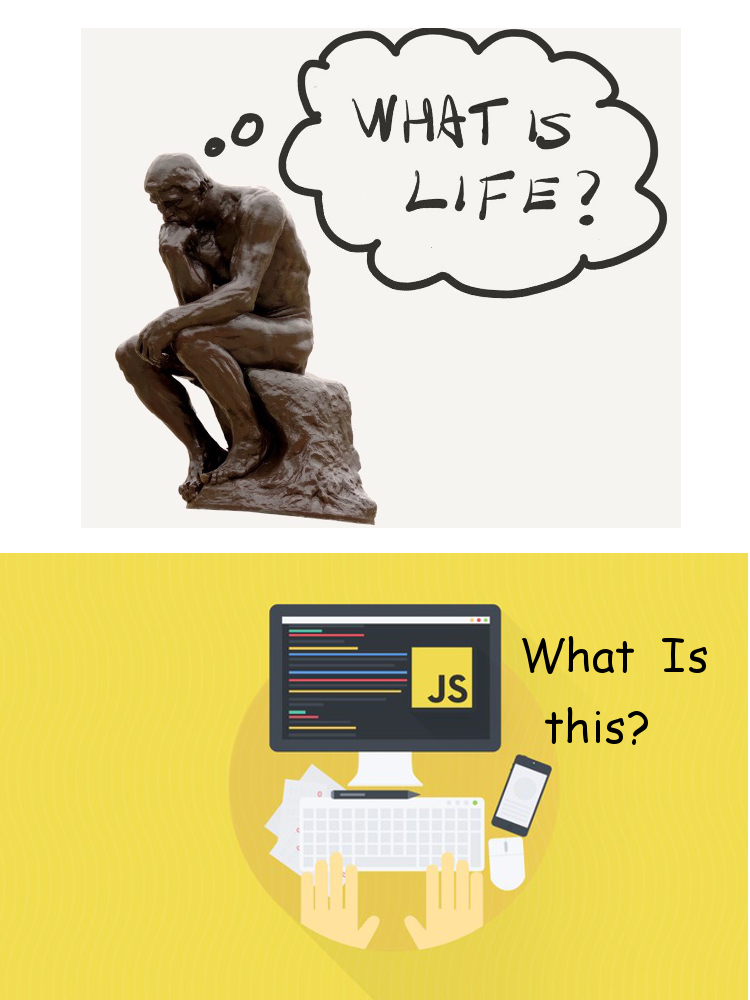
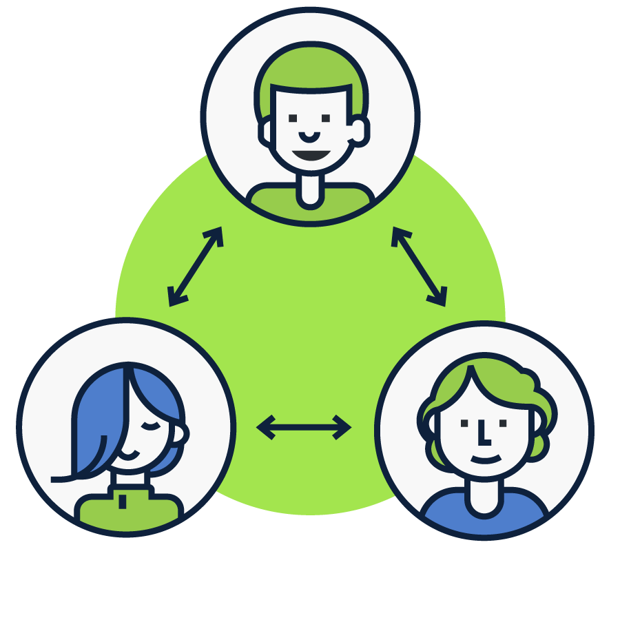
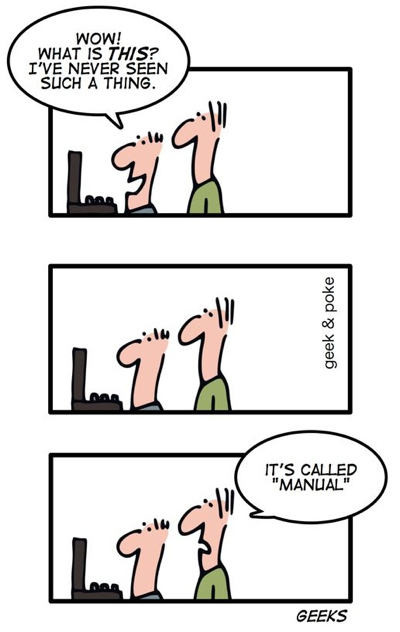

@title[Clean Code]

# MK Web UI Community

#### Introduction

[Presentation Link](https://github.com/ozelen/presentation-webui-community)

 
 
by Oleksiy Zelenyuk

#VSLIDE

# About me

- ozelen@softserveinc.com
- Skype: oleksa.zelenyuk
- Tel. 1531 (int)
- Github: [ozelen](https://github.com/ozelen/)

#VSLIDE

## In love with JS since 1999

#VSLIDE

## Currently

- COE Solutions                           <!-- .element: class="fragment" -->
- Architect at MK for 4 months            <!-- .element: class="fragment" -->
- Discover and kickstart new projects     <!-- .element: class="fragment" -->
- Onboarding new comers                   <!-- .element: class="fragment" -->
- Responsible for Web UI comptence group  <!-- .element: class="fragment" -->

#VSLIDE

## Also

- Came back to SoftServe after 3 years    <!-- .element: class="fragment" -->
- Love trying other languages             <!-- .element: class="fragment" -->
- Love bench press                        <!-- .element: class="fragment" -->

#HSLIDE
## AGENDA

- What this is for <!-- .element: class="fragment" -->
- What we do       <!-- .element: class="fragment" -->
- How to           <!-- .element: class="fragment" -->

#HSLIDE
## What this is for

1. Knowledge sharing       <!-- .element: class="fragment" -->
1. Onboarding new members  <!-- .element: class="fragment" -->
1. Bootcamp for candidates <!-- .element: class="fragment" -->
1. Career & Experience     <!-- .element: class="fragment" -->

#VSLIDE

# Knowledge Sharing

#VSLIDE

## Knowledge Sharing

- Know about each other <!-- .element: class="fragment" -->
- Spread experience     <!-- .element: class="fragment" -->
- Make Tech Proposals   <!-- .element: class="fragment" -->
- Present ideas, solutions, documents, etc.         <!-- .element: class="fragment" -->

#VSLIDE
# Onboarding

#VSLIDE
## Onboarding program

Steps for new members to join quickly

- Internal candidates                                                <!-- .element: class="fragment" -->
- 1-2 weeks to start performing                                      <!-- .element: class="fragment" -->
- Discover internal libs and frameworks                              <!-- .element: class="fragment" -->
- Internal tools and processes like (Git, Jira flow, etc)            <!-- .element: class="fragment" -->

#VSLIDE

# Bootcamp

#VSLIDE

## Bootcamp program

Intesive course for Mid-level developers coming from other companies and tech stacks.

- External candidates                                 <!-- .element: class="fragment" -->
- 2-3 Weeks course                                    <!-- .element: class="fragment" -->
- Change tech stack to the current one                <!-- .element: class="fragment" -->
- Tools and approaches are close to the client's ones <!-- .element: class="fragment" -->

#VSLIDE

## Career & Experience

- Improve presentation skills.            <!-- .element: class="fragment" -->
- Understanding things by presenting them <!-- .element: class="fragment" -->
- Career growth for Abiliton check-list   <!-- .element: class="fragment" -->

#HSLIDE

## What we do

Things that work:

1. Presentations              <!-- .element: class="fragment" -->
1. Workshops with live-coding <!-- .element: class="fragment" -->
1. Documenting                <!-- .element: class="fragment" -->

#HSLIDE

## How to

1. Share knowledge/proposal <!-- .element: class="fragment" -->
1. Become a trainer         <!-- .element: class="fragment" -->
