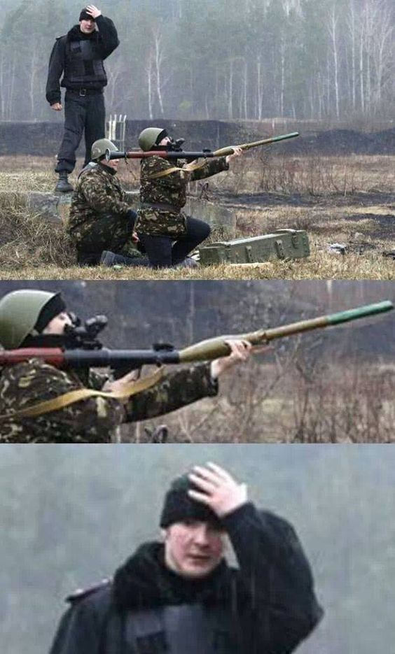

@title[Clean Code]

# MK Web UI Community

#### Introduction
 
 
by Oleksiy Zelenyuk

#VSLIDE

## About me

- With JavaScript in heart since 1999     <!-- .element: class="fragment" -->
- Love trying other languages             <!-- .element: class="fragment" -->
- Came back to SoftServe after 3 years    <!-- .element: class="fragment" -->
- Now at COE Solutions dep.               <!-- .element: class="fragment" -->
- Working 100% for MK as an Architect     <!-- .element: class="fragment" -->
- Statring new projects and discovery     <!-- .element: class="fragment" -->
- Responsible for Web UI comptence group  <!-- .element: class="fragment" -->

#HSLIDE
## AGENDA
- What this is for <!-- .element: class="fragment" -->
- What we do       <!-- .element: class="fragment" -->
- How to           <!-- .element: class="fragment" -->

#HSLIDE
## What this is for

1. Knowledge sharing       <!-- .element: class="fragment" -->
1. Onboarding new members  <!-- .element: class="fragment" -->
1. Bootcamp for candidates <!-- .element: class="fragment" -->
1. Career & Experience     <!-- .element: class="fragment" -->

#VSLIDE

## Knowledge Sharing

- Spread experience   <!-- .element: class="fragment" -->
- Make Tech Proposals <!-- .element: class="fragment" -->
- Socialize           <!-- .element: class="fragment" -->

#VSLIDE

## Onboarding program

Steps for new members to quickly get to internal processes

- Internal candidates                                                <!-- .element: class="fragment" -->
- 1-2 weeks to start performing                                      <!-- .element: class="fragment" -->
- Discover internal libs and frameworks (FEF, PCAS, Dev Layout, etc) <!-- .element: class="fragment" -->
- Internal tools and processes like (Git, Jira flow, etc)            <!-- .element: class="fragment" -->

#VSLIDE

## Bootcamp for candidates

Intesive course for Mid-level developers coming from other tech stacks.

- External candidates                                 <!-- .element: class="fragment" -->
- 2-3 Weeks course                                    <!-- .element: class="fragment" -->
- Change tech stack to the current one                <!-- .element: class="fragment" -->
- Tools and approaches are close to the client's ones <!-- .element: class="fragment" -->

#VSLIDE

## Career & Experience

- Improve presentation skills.            <!-- .element: class="fragment" -->
- Understanding things by presenting them <!-- .element: class="fragment" -->
- Career growth for Abiliton check-list   <!-- .element: class="fragment" -->

#HSLIDE

## What we do

Things that work:

1. Presentations              <!-- .element: class="fragment" -->
1. Workshops with live-coding <!-- .element: class="fragment" -->
1. Documenting                <!-- .element: class="fragment" -->

#HSLIDE

## How to

1. Share knowledge/proposal <!-- .element: class="fragment" -->
1. Become a trainer         <!-- .element: class="fragment" -->
